# Ubica Pellet (Temuco)

Maqueta funcional para **TINF1119 Desarrollo Móvil (A+S)**, evaluación E2. Está hecha con **Kivy + KivyMD**.

## Problema que resuelve

En invierno, en Temuco, hay quiebres de stock de pellet y la gente recorre
ferreterías, bencineras y vendedores particulares sin saber dónde queda.
**Ubica Pellet** es una app colaborativa con **lista y mapa**: los vecinos reportan dónde
vieron pellet (o si se acabó), con precio, sacos y horario. La app te **guía
caminando** hasta el punto y, al llegar, te pregunta si había, para mantener el
dato al día.

## Usuario objetivo

Hogares de Temuco y Padre Las Casas que calefaccionan con estufa a pellet. <!-- TODO: completar con el perfil del diagnóstico (edad, sector, familiaridad tecnológica) -->

## Ejecutar

Requiere Python 3.10 o superior y **conexión a internet** para descargar el mapa y las rutas.

```bash
python -m pip install -r requirements.txt
python main.py
```

En escritorio la ventana simula un celular (400×800). Como no hay GPS, tu
ubicación parte en la Plaza Aníbal Pinto. Con **doble toque** en el mapa la
mueves, y durante una ruta el botón **«Simular caminata»** hace avanzar tu punto
por el camino. En Android la app usa el GPS real (`plyer`).

## Cuentas, opiniones y confiabilidad

- **Cuentas:** registro e inicio de sesión. La contraseña se guarda como hash
  PBKDF2-SHA256 con sal aleatoria, nunca en texto plano (`app/cuentas.py`). Si
  el usuario o la contraseña están mal, el mensaje es el mismo en ambos casos,
  para no revelar qué usuarios existen. Se puede **seguir sin cuenta** (solo
  mirar). Para publicar, reportar stock, opinar o votar hay que entrar.
- **Opiniones:** cada usuario califica un punto con 1 a 5 estrellas y un
  comentario (una opinión por punto, editable). Puede marcar además si había
  pellet, y eso suma un reporte.
- **Calificar opiniones:** los demás marcan cada opinión como **Útil** o **No útil**.
  Nadie puede votar su propia opinión.
- **Reputación y niveles:** +2 por cada voto útil recibido (−2 por cada no útil),
  +2 por publicar un punto y +1 por cada reporte u opinión. Niveles: **Nuevo** (0),
  **Confiable** (6) y **Experto** (15).
- **Confiabilidad del dato: de 0 a 5 estrellas, con medias estrellas** (`app/confianza.py`):
  `estrellas = 5 × (0,4 × frescura + 0,4 × respaldo + 0,2 × reputación)`, redondeado a la media estrella más cercana.
  - Frescura: qué tan reciente es el último reporte (llega a 0 a las 12 h).
  - Respaldo: reportes de 24 h que coinciden con el estado actual. Cada uno pesa según el nivel de su autor y se divide por el total, como mínimo por 2 (un solo reporte nunca basta).
  - Reputación: el nivel de quien hizo el último reporte.
  - Color: **amarillo** con 5 estrellas (excelente), **rojo** con 1½ o menos (poco confiable) y **verde** entre 2 y 4½. En los extremos se agrega la palabra, para no depender solo del color.
  - Las estrellas de confiabilidad son distintas de las **opiniones** (el promedio de 1 a 5 que ponen los usuarios), que se muestran con un ícono de comentario.

Las cuentas y los datos se guardan en el dispositivo (`usuarios.json` y
`puntos_temuco_v2.json`, dentro de `App.user_data_dir`). Las cuentas de ejemplo
(los vecinos que aparecen en las opiniones) no tienen contraseña. **Para probar,
crea tu propia cuenta** en «Crear una cuenta».

## Pantallas y navegación

Hay una barra inferior (`MDNavigationBar`) con 3 pestañas, **Lista · Mapa · Perfil**,
más 6 pantallas secundarias. Todas están en un `MDScreenManager`.

| # | Pantalla | .py | .kv | Qué se hace |
|---|----------|-----|-----|-------------|
| 1 | **Lista** (inicio) | `screens/lista.py` | `kv/lista.kv` | Puntos ordenados por cercanía, con confiabilidad en estrellas, filtros por stock y sector, y el botón **Publicar un punto** |
| 2 | **Mapa** | `screens/mapa.py` | `kv/mapa.kv` | Pines de colores según el stock, tarjeta del punto, **Cómo llegar** y navegación a pie con avance en vivo |
| 3 | **Perfil** | `screens/perfil.py` | `kv/perfil.kv` | Nivel, reputación, aportes, acceso a **Ayuda** y Cerrar sesión |
| 4 | Entrar / Crear cuenta | `screens/entrar.py`, `screens/registro.py` | `kv/entrar.kv`, `kv/registro.kv` | Inicio de sesión, registro con validación o «solo mirar» |
| 5 | Detalle | `screens/detalle.py` | `kv/detalle.kv` | Estado, confiabilidad, dirección, distancia a pie, horario, Cómo llegar, Sigue habiendo / Ya no hay, y opiniones con votos Útil / No útil |
| 6 | Publicar | `screens/formulario.py` | `kv/formulario.kv` | Formulario con validación (se abre desde la Lista) |
| 7 | Elegir ubicación | `screens/elegir.py` | `kv/elegir.kv` | Se mueve el mapa bajo un pin fijo para marcar el punto nuevo |
| 8 | Ayuda | `screens/ayuda.py` | `kv/ayuda.kv` | Colores, estrellas, cómo usar la app (se abre desde el Perfil) |

```
[Entrar] ─ Crear cuenta / Solo mirar ─▶ Lista
[Lista] ─ toca tarjeta ─▶ Detalle ─▶ confirmar / opinar / votar
   └─ Publicar un punto ─▶ Formulario ─ Ubicación ─▶ Elegir en mapa ─▶ Publicar ─▶ Mapa con el punto nuevo
[Mapa] ─ toca pin ─▶ tarjeta ─ Cómo llegar ─▶ ¿Caminando o en auto? ─▶ ruta + tu punto avanza ─▶ «¡Llegaste! ¿Había pellet?»
[Perfil] ─ ¿Tienes dudas? ─▶ Ayuda
   └─ Cerrar sesión ─▶ Entrar
```

## Cómo funciona el mapa

- **Estilo del mapa:** se usa Esri *World Street Map* a través de `kivy_garden.mapview` (`app/mapa.py`). Muestra solo calles y sus nombres, sin números de casas ni íconos de comercios, para que se lea fácil. Las teselas quedan en caché en la carpeta de datos de la app.
- **Cómo llegar:** la app pregunta **«¿Cómo vas a ir?»**:
  - **Caminando:** ruta por veredas y pasajes (servidor OSRM peatonal).
  - **En auto:** ruta que respeta el sentido de las calles (servidor OSRM de autos).

  Los minutos que faltan se calculan con la velocidad media que entrega el servidor para esa ruta (`app/rutas.py`). Si no hay internet, se usa una línea recta como respaldo.
- **Avance:** cada vez que cambia tu posición (GPS o simulada, `app/ubicacion.py`), se calcula el tramo más cercano de la ruta. La parte ya recorrida se pinta en gris y se actualizan los metros y minutos que faltan (`app/geo.py`, fórmula de Haversine). La app avisa que llegaste a menos de 20 m a pie o 35 m en auto.

## Componentes KivyMD usados

`MDNavigationBar`, `MDTopAppBar`, `MDButton` (filled, outlined, tonal, text),
`MDIconButton`, `MDTextField` (outlined, con ícono, hint y helper text), `MDCard`,
`MDDialog`, `MDDropdownMenu`, `MDSnackbar`, `MDLinearProgressIndicator`, `MDGridLayout`, `MDLabel`
(escala tipográfica Material 3), `MDIcon`, `MDScrollView` y `MDScreenManager`.

## Validaciones

- Registro: nombre de 2 caracteres o más; usuario de 3 a 20 caracteres (letras, números, `.` o `_`) que no esté repetido; contraseña de 6 caracteres o más, repetida igual.
- Opinión: de 1 a 5 estrellas y un texto de 5 a 280 caracteres.
- Nombre, dirección y ubicación en el mapa son obligatorios. El campo que falta se marca en rojo y recibe el foco.
- Si había pellet, se piden los sacos y el precio. Solo se aceptan números, y un precio menor a $500 se rechaza.
- Las horas se validan con formato `HH:MM`.
- Antes de publicar o de cambiar el estado de un punto, la app muestra un diálogo de confirmación.

## Estructura

```
pellet/
├── main.py                     # punto de entrada
├── requirements.txt
├── README.md
├── FUNDAMENTACION-UX-UI.md     # fundamentación del diseño con evidencia de usuarios
├── assets/                     # íconos del mapa (pines, "tú")
├── tools/generar_iconos.py     # genera los PNG de assets/
├── docs/                       # capturas y guion de la presentación
└── app/
    ├── pelletapp.py            # MDApp: build(), ScreenManager, barra inferior, datos, acciones
    ├── cuentas.py              # registro, login (hash PBKDF2), reputación y niveles
    ├── confianza.py            # % de confiabilidad de cada punto y promedio de estrellas
    ├── config.py               # sectores de Temuco, mapa, colores
    ├── data.py                 # puntos, vecinos, reportes y opiniones de ejemplo (ficticios)
    ├── mapa.py                 # MapView, pines, capa de la ruta
    ├── rutas.py                # ruta a pie (OSRM)
    ├── ubicacion.py            # GPS (Android) o ubicación simulada
    ├── geo.py                  # distancias y avance sobre la ruta
    ├── utils.py                # formato de fecha, dinero y textos de un punto
    ├── widgets.py              # PuntoCard, OpinionCard, ItemNav, Raiz
    ├── compat.py               # parche de un bug de KivyMD 2.0.0 (ripple con alto 0)
    ├── kv/                     # interfaz declarativa (KV Language), un .kv por pantalla
    └── screens/                # lógica de cada pantalla
```

La **interfaz** está en los `.kv` y la **lógica** (filtros, validación, rutas,
eventos) en los `.py`. Los datos se guardan en `puntos_temuco.json`, dentro de
`App.user_data_dir` (esto no se evalúa en la E2).

## Capturas

| Mapa | Navegando | Llegada |
|---|---|---|
| 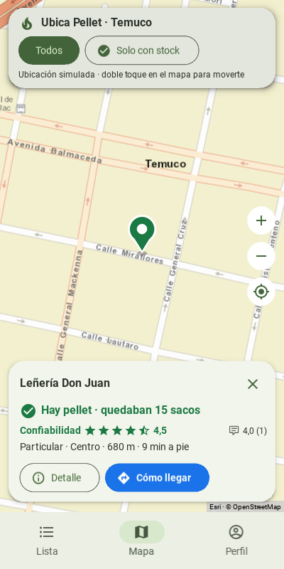 | 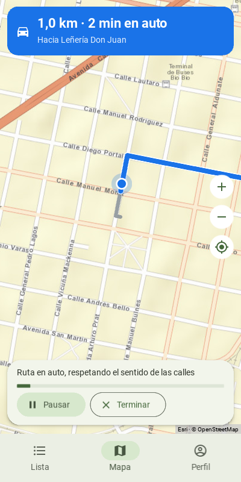 | 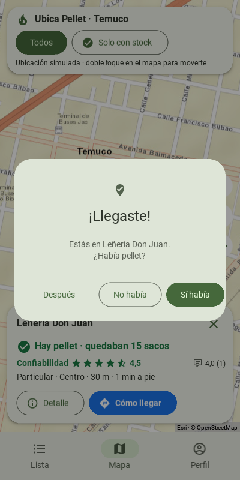 |

| Lista | Detalle | Publicar | Marcar ubicación | Ayuda |
|---|---|---|---|---|
| 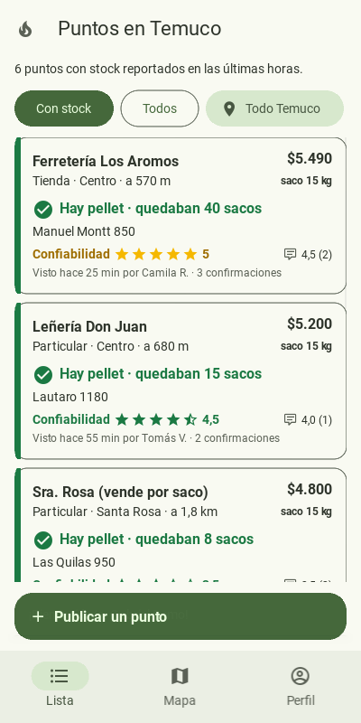 | 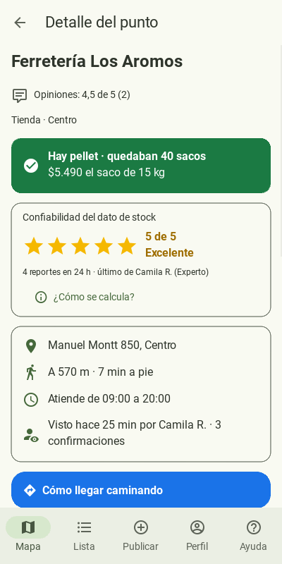 | 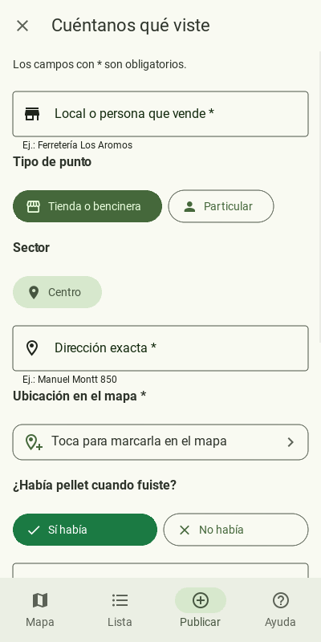 | 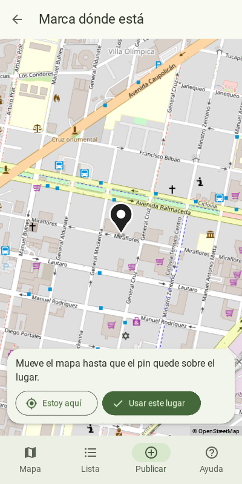 | 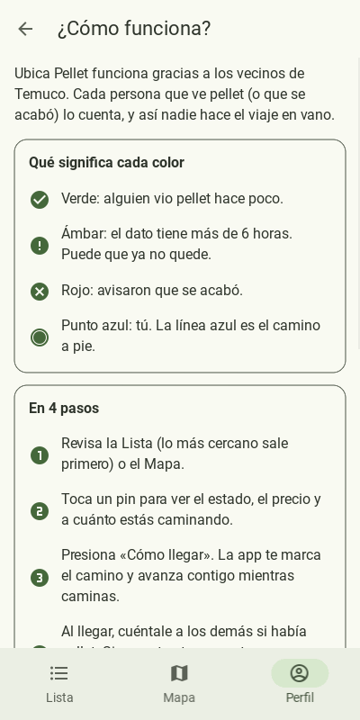 |

| Entrar | Crear cuenta | Opiniones | Perfil | Cómo se calcula | Confiabilidad baja |
|---|---|---|---|---|---|
| 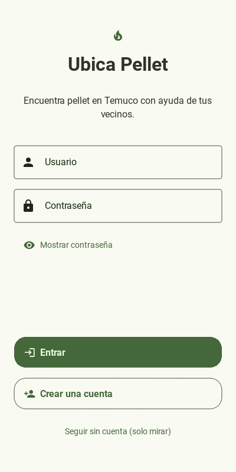 | 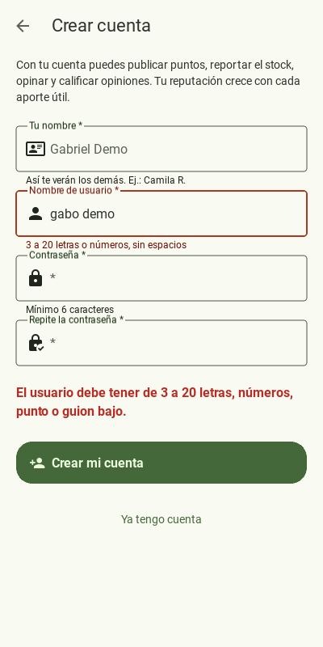 | 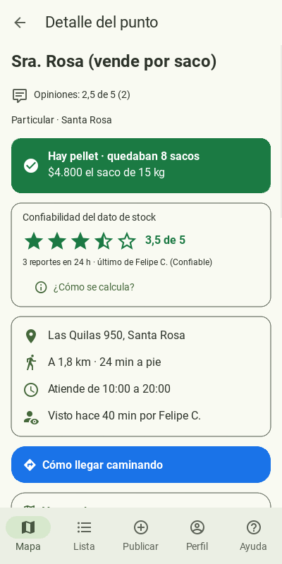 | 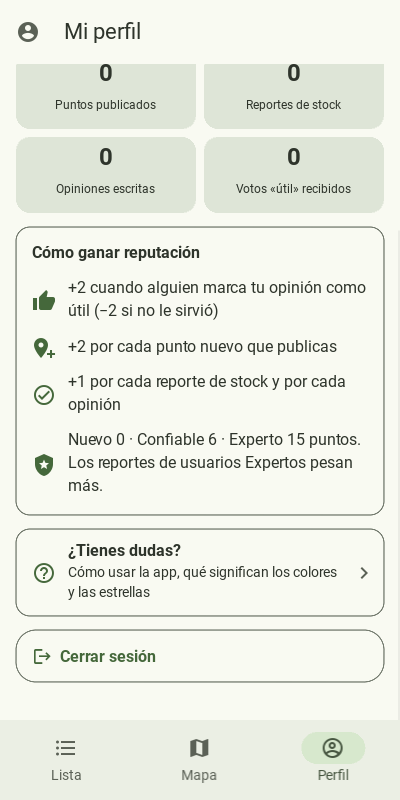 | 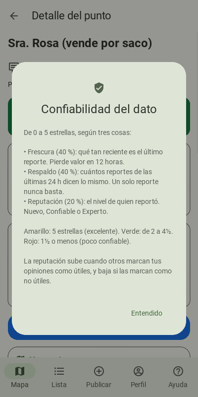 | 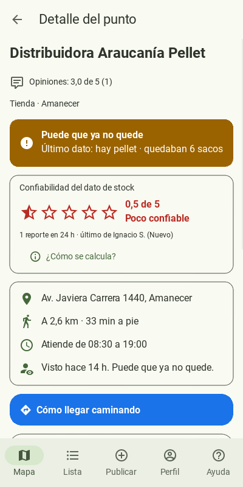 |

## Créditos

- Mapa: Esri World Street Map (fuentes: Esri, HERE, Garmin y colaboradores de [OpenStreetMap](https://www.openstreetmap.org/copyright)).
- Rutas: [OSRM](https://project-osrm.org/) (servidores de routing.openstreetmap.de, perfiles peatonal y de auto).

## Declaración de uso de IA

Durante el desarrollo se usó un asistente de IA (Claude, de Anthropic) para
migrar la interfaz a KivyMD, implementar el mapa, la navegación a pie, las cuentas,
las opiniones y el cálculo de confiabilidad, depurar
un error de KivyMD 2.0.0 y redactar la documentación. <!-- TODO: ajustar según lo que realmente hiciste tú -->
El diagnóstico con usuarios (entrevistas y encuestas) y las decisiones de diseño
derivadas son trabajo del/los estudiante(s).
